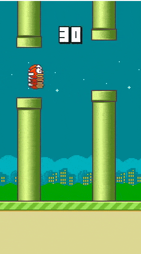

# Flappy Bird AI using NeuroEvolution
A python implementation of the NeuroEvolution algorithm. Used for training an artificial player in the classic Flappy Bird game written in pygame. Uses Genetic Algorithm (NeuroEvolution) including crossover and mutations on a population of players to generate better models.



## Evaluation
By default, the current best model is tested when you run
```
python neuroEvolution.py
```

## References
1. https://github.com/sourabhv/FlapPyBird
2. https://github.com/aiatuci/flappy_bird_workshop
